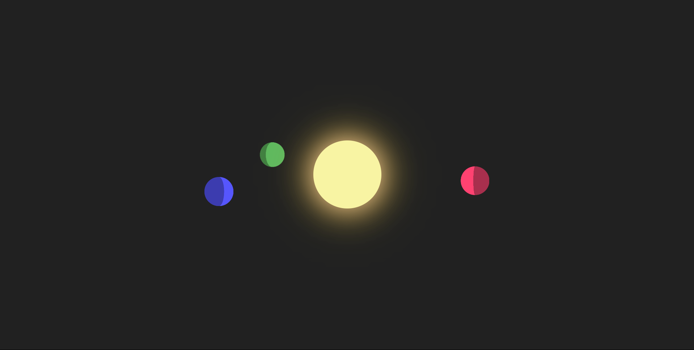

# CSS Planet Spinner

## Description

A calming, CSS-only animation inspired by my love of astronomy.  
This project simulates orbiting planets around a sun using only HTML and CSS — no JavaScript at all.  
It's a simple yet visually satisfying experiment that demonstrates creative use of keyframes, gradients, transforms, and z-index layering.

---

## Usage

You can clone or download the repo and open the `index.html` file in your browser.  
Alternatively, visit the website by clicking the link below.

---

## Features

- Smooth orbiting planet animation using CSS `@keyframes`
- Gradient shading and light simulation
- No JavaScript — built entirely with HTML and CSS
- Z-index control to simulate depth
- Designed to feel peaceful and meditative

---

## Technologies Used

- HTML5
- CSS3 (animations, transforms, gradients)

---

## Screenshot

---

## The Website

[The website](https://grand-bublanina-3dcb00.netlify.app/)

---

## License

MIT License  
(Please refer to the [LICENSE](./LICENSE))
